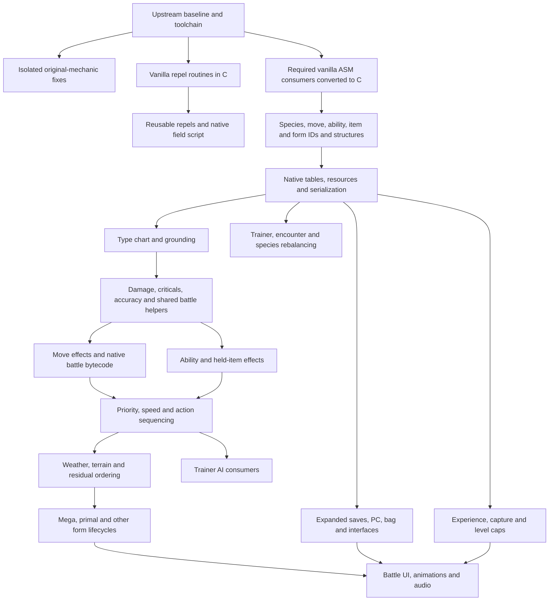

# NewGold native migration

This branch extends `pret/pokeheartgold` with native source/data implementations
of `konefr/hg-engine-newgold`. The reference patch engine is kept outside this
repository. It is not linked, embedded, or used to build the port.

## Reference revisions

| Input | Revision |
| --- | --- |
| pokeheartgold upstream | `e97c7fc975a7447f288c42acc2e155f5a673e30f` |
| NewGold, `heartgold-modern` | `1b872926eaa0363816d4e376fad1531435b04b9c` |
| Upstream HeartGold symbol map | `ea4460e154ddaaca5a6deebd4b5254c2a3d484ae`, `heartgoldus.xMAP` |

Branch: `port/newgold-native`. The original analysis was read-only; no earlier
port commits, build, or saved migration document existed in this workspace.
The initial classification describes **original functions**, not completed work.

Use the reference's default `include/config.h` and `include/debug.h` settings.
The release generation is 9, but individual Champions settings also apply.
Do not replace these choices with a blanket assumption of Generation 9 behavior.

## Progress counters

| Metric | Count / state |
| --- | --- |
| Originally identified hook targets | 344 distinct functions |
| Original C / ASM targets | 302 / 42 |
| Originally unresolved hook declarations | 5 |
| Intended targets after evidence-based resolution | 349 distinct functions |
| Original C / ASM including resolved targets | 307 / 42 |
| Semantically unidentified hook targets remaining | 0 |
| Source hook-installation anomalies retained in the record | 5 |
| ASM targets converted to C | 2, both vanilla conversions verified MATCHING before the feature |
| Current mapped targets represented in C | 309 |
| ASM targets remaining | 40 |
| Entire hook replacements made unnecessary | 2, repel expiry and bag-use hooks |
| Instruction-patch behaviors represented natively | 3, Rage, Fire Fang / Shadow Force and overworld poison |
| Function-pointer patch replacements made unnecessary | 1, reusable-repel script handler |
| Reference binary patch mechanisms made unnecessary | 4: three instruction changes and one script-handler pointer replacement |
| Features ported | 4: Rage, Fire Fang / Shadow Force, reusable repels, overworld poison |
| Features verified at C/resource boundaries | 4; emulator scenarios still pending |
| Features checked in a running ROM | 0 |
| Complete ROM build | HeartGold and SoulSilver PASS through M4; prerequisite C conversions separately matched both retail ROMs |
| NewGold hook / binary instruction patch / executable ASM implementations added | 0 / 0 / 0 |

These are distinct metrics. Several hooks can touch one function; one hook can
replace a function implementing many features. Porting Rage does **not** retire
the entire `ServerBeforeAct` replacement. Data relocation is not executable
patching. Field and battle script `.s` files assemble bytecode, not ARM code.
The remaining 40 ASM targets refer to the initial hook census. Additional ASM
consumers needed by data expansion or non-hook patches must be tracked when
identified; this is not a claim that only 40 ASM routines remain in the game.

Statuses: `NOT STARTED`, `MAPPED`, `VANILLA C DECOMPILED`, `PORTED`, `BUILDS`,
`VERIFIED`. Verification must state its scope: host function test, matching
vanilla ROM, modified ROM build, or emulator/hardware scenario. A successful host
test is not a ROM verification. NewGold-modified functions intentionally differ
from the vanilla binary; matching applies to the preceding vanilla conversion.

## Dependency graph

This graph gives prerequisites, not permission to migrate everything in one
commit. Extend structures only for a concrete feature and inspect every C and
ASM consumer before moving fields or changing their widths.

## Feature ledger

All paths below are relative to the corresponding repository. Rows summarize
the existing analysis; the generated manifest ledger supplies individual patch
and hook declarations. A family marked MAPPED is not a claim that every behavior
inside it has been implemented or completely specified.

| Subsystem / category | NewGold implementation | Native target and original state | Current state | Dependencies and validation |
| --- | --- | --- | --- | --- |
| Rage cleanup / executable logic | `src/individual/ServerBeforeAct.c::ServerBeforeActInternal`, `SBA_RAGE`; `armips/asm/moves.s` Rage fix | `src/battle/battle_controller_player.c::BattleControllerPlayer_BeforeTurn`, C | BUILDS; VERIFIED (host) | Actual-C regression and both modified ROM builds pass; emulator scenario pending; see M1 |
| Fire Fang / Shadow Force classification / executable logic | `bytereplacement`, `0225848C` | `src/battle/overlay_12_0224E4FC.c::ov12_02258440`, C | BUILDS; VERIFIED (host) | Both ROMs pass; actual helper and shared live/AI predicates checked; emulator pending; see M2 |
| Reusable repels / executable logic and script | `src/repel.c`, `hooks`, `routinepointers`, `armips/asm/repel.s`, common-script changes | `asm/overlay_02_02248728.s::PlayerStepEvent_RepelCounterDecrement`; `asm/overlay_15.s::BagApp_GetRepelStepCountAddr`, ASM; native common script and script command table | BUILDS; VERIFIED (C/resources) | Both vanilla conversions matched retail; native reuse feature builds on HG/SS and passes source/asset checks; runtime UI pending |
| Overworld poison disabled / executable logic | `include/config.h::UPDATE_OVERWORLD_POISON`, `bytereplacement:118` | `src/script_pokemon_util.c::ApplyPoisonStep`, C | BUILDS; VERIFIED (host) | Both ROMs pass; accessor integrity checks and four-step counter preserved; see M4 |
| Core battle state / executable logic | `include/battle.h`, `src/battle/battle_start.c`, `armips/asm/moves.s` | `include/battle/battle.h`, `BattleContext_New`, `BattleContext_Init`, C with ASM consumers | MAPPED | Required consumers must be C before layout changes; ABI/offset/save checks |
| Expanded move IDs, data and bytecode / data, script, executable logic | `data/Moves.c`, `src/moves.c`, `src/battle/battle_script_commands.c` | `include/constants/moves.h`, `include/constants/move_effects.h`, `src/battle/battle_command.c`, `files/poketool/waza`, `files/battledata/script`, C/data | MAPPED | IDs, table limits, script command dispatch and messages; per-effect tests |
| Damage, accuracy and criticals / executable logic | `src/individual/CalcBaseDamage.c`, `src/battle/battle_calc_damage.c`, `src/battle/other_battle_calculators.c` | `CalcMoveDamage`, `TryCriticalHit`, `BattleSystem_CheckMoveHit`, C | MAPPED | Type, item, ability and state prerequisites; exact integer rounding and RNG |
| Fairy and effectiveness / executable logic, data, resource | `src/battle/battle_pokemon.c`, `src/battle/other_battle_calculators.c`, `armips/asm/fairy.s` | `sTypeEffectiveness`, `CalculateTypeEffectiveness`, `Battler_GetType`, `ov12_02252054`, C; some AI/UI ASM | MAPPED | Native type constants and graphics; Hidden Power, plates and AI consumers |
| Expanded abilities / executable logic and data | `include/constants/ability.h`, `data/AbilityFlags.c`, `src/battle/ability.c`, `src/individual/SwitchInAbilityCheck.c`, `src/individual/MoveHitDefenderAbilityCheck.c` | `TryAbilityOnEntry`, `CheckAbilityEffectOnHit`, ability accessors, C; widened fields have ASM consumers | MAPPED | Ability ID/storage width, summary/AI consumers; per-ability behavioral cases |
| Held items and restoration / executable logic and data | `src/battle/battle_item.c`, `src/individual/CheckDefenderItemEffectOnHit.c`, `src/battle/battle_start.c` | `TryUseHeldItem`, `CheckItemEffectOnHit`, `CanTrickHeldItem`, `TryFling`, C | MAPPED | Item IDs/data and battle lifecycle; preserve restoration and AI item settings |
| Speed and priority / executable logic | `src/battle/other_battle_calculators.c`, `src/individual/ServerBeforeAct.c` | `CheckSortSpeed`, `SortMonsBySpeed`, `SortExecutionOrderBySpeed`, player controller, C | MAPPED | State and ability/item prerequisites; ties, RNG and midturn changes |
| Action and hit sequencing / executable logic | `src/individual/BattleController_BeforeMove.c`, `ServerDoPostMoveEffects.c`, `ServerHPCalc.c`, `BattleController_MoveEnd.c` | `src/battle/battle_controller_player.c`, C | MAPPED | Move/item/ability primitives; multihit, spread, faint and per-target timing |
| Weather and terrain / executable logic and script | `src/battle/weather.c`, `src/individual/ServerFieldConditionCheck.c` | Field/mon condition states in `battle_controller_player.c`, weather commands, C | MAPPED | Battle state, ordering and presentation; source TODO states remain documented |
| Mega and primal / executable logic, data, resource | `src/battle/mega.c`, `src/individual/ServerBeforeAct.c`, `src/battle/battle_pokemon.c`, `src/battle/battle_input.c` | Native form/data helpers and before-turn controller, C; presentation mixed C/ASM | MAPPED | Species/forms, items, ability/weather lifecycle, resources, UI; revert/persistence tests |
| Illusion and other forms / executable logic and resource | `src/individual/BattleFormChangeCheck.c`, `src/battle/battle_pokemon.c`, `asm/battle/battle_hooks.s` | Form checks, battle input, HP bar and encounter controllers, mixed C/ASM | MAPPED | Separate actual and displayed identity; cries, names, targeting and break/revert checks |
| Trainer AI / executable logic | `src/battle/ai.c`, `armips/asm/trainer_ai.s` | `src/battle/trainer_ai.c`, `asm/overlay_10_trainer_ai.s`, mixed C/ASM | MAPPED | C conversion of required AI routines, then new move/type/ability consumers |
| Capture and EXP / executable logic, script, resource | `src/battle/battle_script_commands.c`, `src/individual/CalculateBallShakes.c`, capture stubs | Capture/EXP commands and tasks in `src/battle/battle_command.c`, C; ball animation ASM | MAPPED | Pokédex, item modifiers, EXP lifecycle and animation; release-config comparisons |
| Battle presentation / executable logic and resource | `src/battle/anim.c`, `src/battle/battle_input.c`, ability popup command, HP speed patches | `battle_input.c`, `battle_hp_bar.c`, `battle_system.c`; `asm/overlay_07.s`, mixed C/ASM | MAPPED | Native tasks/windows/sprites, animation C conversions and generated assets |
| Pokémon and forms / executable logic and data | `src/pokemon.c`, `data` species/form tables, `armips/data` | `src/pokemon.c`, `include/pokemon_types_def.h`, native personal/learnset/evolution resources, C/data | MAPPED | IDs, forms, bounds, serialization and all ASM consumers |
| Level caps / executable logic | `src/pokemon.c::GetLevelCap` and EXP paths | Native Pokémon/EXP C and flags/variables | MAPPED | Preserve badge/story thresholds and candy/evolution configuration |
| Konefr species, teams and encounters / data | `armips/data` personal/trainer/encounter edits | Native personal, trainer and encounter JSON/data; `src/trainer_data.c::CreateNPCTrainerParty`, C | MAPPED | Expanded species/ability/move/item support before dependent team rows |
| Bug-catching contest and field events / script and data | Contest data and patched field scripts | Native contest CSV, judging C and field bytecode | MAPPED | Species IDs and native message/script resources; reward and encounter checks |
| Shops and EV presets / executable logic and script | Expanded mart scripts and overloaded egg command | `src/scrcmd_mart.c`, `src/scrcmd_party.c`, native map scripts, C/script | MAPPED | Preserve password/vendor behavior; use dedicated semantic commands, no species-ID command overloading |
| Poison, TMs/HMs, vitamins and friendship / executable logic and data | `src/field.c`, `src/pokemon.c`, item functions, config | `src/script_pokemon_util.c`, `src/party_menu_items.c`, `src/use_item_on_mon.c`, `src/pokemon.c`, C | MAPPED | Separate small behavioral milestones; source config and RNG/message checks |
| Save and PC expansion / executable logic and data | Save/storage structs and patches, 30-box configuration | `src/save.c`, `src/pokemon_storage_system.c`, C; PC UI `asm/overlay_14.s` | MAPPED | Serialization sizes, checksums, bounds, UI consumers and explicit save compatibility |
| Bag expansion / executable logic and data | Pocket expansion and repoints | `src/bag.c`, C; bag application `asm/overlay_15.s` | MAPPED | Native arrays/serialization and all UI consumers; inventory bounds |
| Summary, EV/IV viewer and Pokédex / executable logic and resource | Summary/UI changes and expansion patches | `asm/unk_02088288.s`, `asm/unk_0208C3E4.s`, mixed Pokédex C/ASM | MAPPED | C conversions, species/ability data widths, strings and display resources |
| Cries and audio expansion / executable logic and resource | Cry pseudobanks and `NNSi_SndArcLoadBank_hook` | `src/sound.c`, `asm/unk_02005D10.s`, `lib/asm/nnsys.s`, mixed C/ASM | MAPPED | Understand pseudobank contract; native bank/resource loading and boundary tests |
| Overworld/followers, camera, seasons and roamers / executable logic, data, resource | Field/follower routines, BDHCam, seasons and roamer patches | Native field/follower/camera/roamer C with overlay consumers | MAPPED | Resolve BDHCam contract, native resource tables and state consumers before implementation |
| Injected overlays/linker support / build-system support | `rom.ld`, `hooks`, `armhooks`, `bytereplacement`, `repoints`, `routinepointers`, `armips/global.s` | Native C object lists in `main.lsf`, existing overlay and data build | NOT STARTED | Retire feature by feature; no hook compatibility layer or executable blobs |

## Vanilla prerequisite — Repel routines in matching C

| Function | Original implementation | Native implementation | Validation |
| --- | --- | --- | --- |
| `PlayerStepEvent_RepelCounterDecrement` | `asm/overlay_02_02248728.s` | `src/field/repel.c` | MATCHING C, both full retail ROM checksums pass |
| `BagApp_GetRepelStepCountAddr` | `asm/overlay_15.s` | `src/bag_app.c` | MATCHING C, both full retail ROM checksums pass |

The second function is an existing counter **setter**, despite its upstream
name. Its only caller uses it that way; the canonical name is retained.
The ordinary `main.lsf` object list places each C routine between the original
assembly prefix and a separate untouched suffix. Existing overlay `.inc` files
provide the cross-object symbol declarations. No executable assembly was added
or altered beyond removal of these two routines. The full matching ROM checks
also validate that moving the untouched assembly/data did not change its bytes.

This prerequisite does not itself add reusable repels or retire those hooks.
See `VALIDATION.md` for toolchain, checksums and commands.

## M1 — Correct Rage cleanup

* Vanilla: leaving Rage incorrectly retains its bit and clears unrelated volatile
  flags in `BattleControllerPlayer_BeforeTurn`.
* Reference: `ServerBeforeActInternal`, `SBA_RAGE`, clears only `STATUS2_RAGE`;
  the same correction appears as an instruction patch in `armips/asm/moves.s`.
* Implementation: change the existing assignment to `&= ~STATUS2_RAGE`.
  No structures, resources, overlays, RNG calls or other turn states change.
* Automated check: `python3 tests/newgold/test_battle_regressions.py` compiles the
  actual source function with a host fixture. It fails on upstream and passes on
  the port. It covers every other status bit, continuing Rage, absent Rage,
  two/four battlers, inactive battlers, state transitions and four existing RNG
  draws. This does not test the Nintendo DS ABI or rendering.
* Required ROM check: use Rage, retain another volatile condition, then choose
  another move. That condition must persist and later hits must not raise Attack
  through Rage. Check the other battlers remain unaffected in doubles.
* Build: full HeartGold and SoulSilver builds pass with `COMPARE=0`; no new
  compiler/assembler warnings. Native relocation updates affect overlays 8, 10
  and 12; no NitroFS resources or ARM7 bytes change.
* Dependencies: baseline build only. Whole `ServerBeforeAct` hook remains pending.

## M2 — Correct Fire Fang / Shadow Force effectiveness timing

* Reference: `bytereplacement` changes effect 273 to 272 at `0225848C`.
* Target: `src/battle/overlay_12_0224E4FC.c::ov12_02258440`.
* Implement with `MOVE_EFFECT_SHADOW_FORCE`, replacing
  `MOVE_EFFECT_FLINCH_BURN_HIT` in the charge-phase predicate.
* Both live damage/type handling (`ov12_02251D28`) and AI effectiveness
  (`ov12_02252054`) call this helper; fix the shared helper once.
* Checks: Fire Fang is evaluated immediately; Shadow Force is deferred until its
  hit phase; other effects retain their existing classification. ROM checks
  include neutral/resisted Fire Fang against Wonder Guard (not only Shedinja's
  ordinarily super-effective matchup), super-effective attacks, Shadow Force
  charge/hit phases and AI evaluation.
* Validation: `python3 tests/newgold/test_wonder_guard.py` executes the actual
  helper and both caller predicates: 277 effects, charge/hit and unrelated-bit
  patterns, type-effectiveness combinations, Wonder Guard, Mold Breaker and zero/
  nonzero power. The original implementation demonstrably fails the regression.
  Both full ROM builds pass without compiler/assembler warnings. Only overlay 12
  differs from M1; all other modules and resources are identical.
* Dependencies: baseline build only; no Fairy/type-chart expansion required.

## M3 — Reusable repels

Source: `src/repel.c` (counter, selection, use and duration),
`src/script_new_cmds.c::Script_RunNewCmd`, `asm/other_hook.s` (bag hook),
`hooks:525–528`, `routinepointers:8`,
`armips/scr_seq/scr_seq_00003_commonscript.s` entry 72 and `data/text/040.txt`
entries 118–119. Default `IMPLEMENT_REUSABLE_REPELS` is enabled.

Native implementation:

| Part | Files / functions | State |
| --- | --- | --- |
| Expiry and item use | `src/field/repel.c`: `PlayerStepEvent_RepelCounterDecrement`, `GetPreferredRepel`, `FieldSystem_UseNextRepel`; declaration in `include/overlay_2/overlay_02_02248728.h` | BUILDS; VERIFIED (C/resource boundaries) |
| Ordinary bag use | `src/bag_app.c::BagApp_GetRepelStepCountAddr` | Vanilla MATCHING C; no extra global refresh is needed |
| Script command | `src/scrcmd_items.c::ScrCmd_UseNextRepel`, `include/scrcmd.h`, `src/data/fieldmap/script_cmd_table.h`, `asm/macros/script.inc` | Native appended opcode 853; old opcodes 0–852 preserved |
| Prompt | `files/fielddata/script/scr_seq/scr_seq_0003.s`, `event_0003.h`, `include/constants/std_script.h` | Native common entry 72 / `std_reuse_repel`; no replaced original script |
| Text | `files/msgdata/msg/msg_0040.gmm` entries 117–118 | Native message resources; all original rows preserved |

The counter decrements normally. On expiry, another available repel triggers
script 2072; an empty inventory uses the existing script 2022. Yes consumes one
item and restores its data-defined duration (100/200/250). No or B leaves the
counter expired and does not consume an item. The selected item is buffered in
the confirmation message. No save structure or inventory limit changes.

Reference details deliberately preserved:

* Selection is **Max > Super > normal Repel**, even if a different repel was last
  used. The source's `CurrentRepelType` is refreshed by every reader; it carries
  no required persistent state. The bag hook's refresh is therefore unnecessary.
* NewGold's `PlayFanfare` macro emits opcode 73, which is native `PlaySE`;
  `wait_button_or_walk_away` emits opcode 50, which is native `WaitButton`.
* The source command returns the selected item ID even when item removal fails.
  The native command preserves that behavior. Directly invoking it without an
  item can therefore report a selected item without consumption; the normal
  locked prompt first checks availability. This source quirk was not silently
  changed into a different command contract.

The helper is in overlay 2, used by the expiry-triggered field script while its
field context has that overlay loaded. Other map-loading modes conditionally
omit the extended field overlay; the new script is not started in those modes.
Do not call this command from unrelated overlay contexts without reviewing their
lifetime requirements.

Dependencies: the two separately validated vanilla ASM-to-C conversions. The
feature uses existing item IDs, bag helpers and duration data. It requires no
expanded species, items, save data, new injected overlay, or generic command
multiplexer. The source's two branch hooks and its script-handler pointer patch
are now unnecessary; both complete ROMs build successfully.

Validation: `python3 tests/newgold/test_repels.py` compiles the actual native
functions and, when the sibling reference checkout or `--reference PATH` is
available, the pinned NewGold C. It checks all 256 counter values across 27
inventories (6,912 cases), 81 consumption/command cases, all 256 ordinary bag
setter inputs, the native Yes/No/B/wait handler, command-table preservation,
script wiring and original/new message rows. The script/input checks are host
checks, not execution of the entire field VM in an emulator.

Both full ROM builds pass without compiler/assembler warnings. The compiled
command table has 854 entries; entry 853 resolves to the Thumb address of
`ScrCmd_UseNextRepel`. The compiled common bank has 73 entries, with the new
entry 72 containing one use command, and message bank 40 has 119 messages.
Only script NARC `a/0/1/2` member 3 and message NARC `a/0/2/7` member 40 change;
all other non-overlay resources and ARM7 are unchanged from M2. See
`VALIDATION.md` for hashes and the relocation audit.

Required ROM checks still pending: expire normal/Super/Max Repel; mixed inventory
priority; consume the last item; empty-bag fallback; No/B cancellation; correct
item message, sound and duration; save/reload with an active repel; field exit/
reentry and ordinary bag use. These are not replaced by successful compilation.

## M4 — Disable overworld poison damage

Source: default-enabled `include/config.h::UPDATE_OVERWORLD_POISON`,
`bytereplacement:116–121`. The pinned upstream map identifies
`ApplyPoisonStep` at `02054440`. Disassembling the verified baseline confirms
that `02054474` loads the poison mask `0x88` immediately after the status read;
the source changes it to zero, making the damage branch unreachable.

Native implementation: `src/script_pokemon_util.c::ApplyPoisonStep` removes
the HP, friendship and mood modification branch and returns `FIELD_POISON_NONE`.
The party scan and original accessor order remain because `GetMonData` checks
encrypted data integrity and can set `checksumFailed`. Fainted Pokémon read HP
only; live eggs/bad eggs also read egg status; eligible Pokémon additionally
read status. An unconditional return would discard those checks.

The sole caller, `src/field/field_control.c::FieldSystem_UpdatePoison`, retains
its four-step counter, including u16 wrap, and map-section lookup cadence.
Walking does not damage or cure poison, modify friendship/mood through poison,
play the poison effect, or start the survival message. Battle poison and the
separately callable `SurvivePoisoning` script helper remain untouched.
No ASM conversion, save change or expanded data is required.

`python3 tests/newgold/test_field_poison.py` compiles the actual function,
eligibility helper, `GetMonData` and field caller. A test-only oracle expresses
the reference's zero mask in pinned vanilla C. It checks 10,240 single-Pokémon
cases, mixed parties of sizes 0–6 (including existing checksum-failure flags),
accessor order and all 65,536 counter values. The unmodified vanilla function
still demonstrates damage and survival behavior. Encryption/checksum boundaries
are instrumented, not DS encryption emulation.

Both full ROM builds pass without compiler/assembler warnings. The compiled
54-byte function calls only the four expected party/accessor helpers and returns
zero; no damage/status/friendship/effect call remains. No non-overlay NitroFS
resource or ARM7 bytes change from M3. Ordinary ARM9 relocation updates affect
118 overlays. One additional instruction-patch behavior is now native; this
feature does not change the hook-target C/ASM census.

Required ROM checks: walk with normal/bad poison at 1, 2 and higher HP; mix
healthy, fainted and egg party slots; verify no field effect/message/cure; enter
a battle and verify poison still damages there. Save/reload and map transitions
must retain the ordinary step counter. These runtime scenarios remain pending.

## Next independent milestone

The next progression candidate is the 160
friendship threshold for the three existing evolution methods. Full NewGold
evolution behavior additionally requires new methods/Fairy/species; in particular
its Eevee Fairy-move evolution takes precedence over day/night evolution. Do not
claim that the threshold alone ports the entire evolution subsystem or alter
Elm's independent 220 friendship dialogue condition.

## Build and review policy

Use the upstream toolchain and normal build pipeline. The upstream build assumes
a checkout path without spaces; this workspace uses a separate space-free
validation copy instead of changing unrelated Makefiles. Baseline builds use
`COMPARE=1`; intentionally modified ROMs use `COMPARE=0`. Record both HeartGold
and SoulSilver results, introduced warnings, and any unexecuted ROM scenarios.

Run `git diff --check`, focused tests, and the repository's C formatting check.
Do not claim a whole-file format failure predating the port is introduced by a
one-line edit; preserve unrelated formatting. No PR is authorized.

Credit: the behavior reference is hg-engine/NewGold and its contributors; see
`UPSTREAM_CREDITS.md`. Decompiled vanilla code and architecture are from pret.
